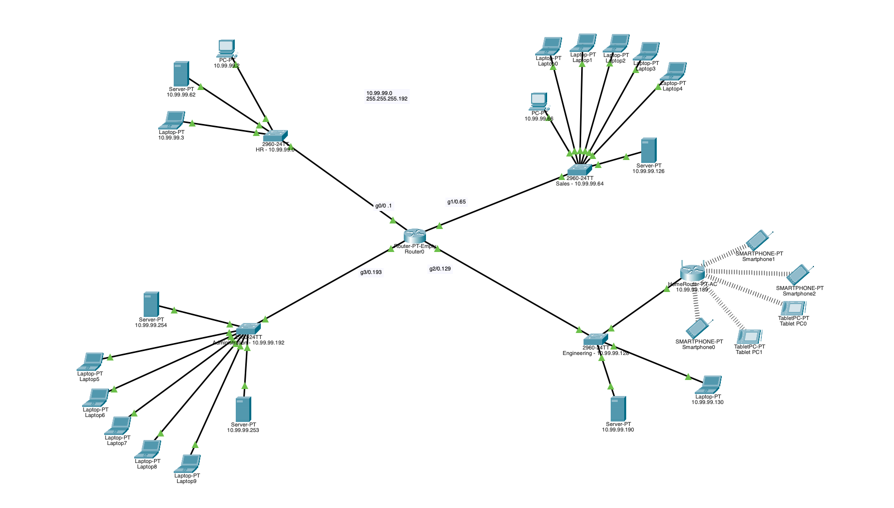

# Cisco Packet Tracer Enterprise Network

## Overview

This project is an enterprise network simulation created in **Cisco Packet Tracer** to practice core networking concepts.

The network is divided into four departments:

* Human Resources
* Sales
* Engineering
* Administration

Each department operates on its own subnet and connects through a central router.

## Network Design

The `10.99.99.0/24` network was divided into four `/26` subnets.

| Department      | Network           | Default Gateway |
| --------------- | ----------------- | --------------- |
| Human Resources | `10.99.99.0/26`   | `10.99.99.1`    |
| Sales           | `10.99.99.64/26`  | `10.99.99.65`   |
| Engineering     | `10.99.99.128/26` | `10.99.99.129`  |
| Administration  | `10.99.99.192/26` | `10.99.99.193`  |

## What I Configured

* IPv4 addressing and subnetting
* Router interfaces for communication between departments
* Cisco switches for each departmental network
* DHCP for automatic IP address assignment
* Static IP addresses for selected devices and servers
* Wired and wireless client devices
* A separate wireless network within the Engineering department

## Network Topology

## Skills Practiced

* TCP/IP fundamentals
* IPv4 subnetting
* DHCP
* Default gateways
* Routing
* Switching
* Wireless networking
* Basic network troubleshooting

## Project File

The full Packet Tracer simulation is included in this repository:

`enterprise-network-simulation.pkt`

